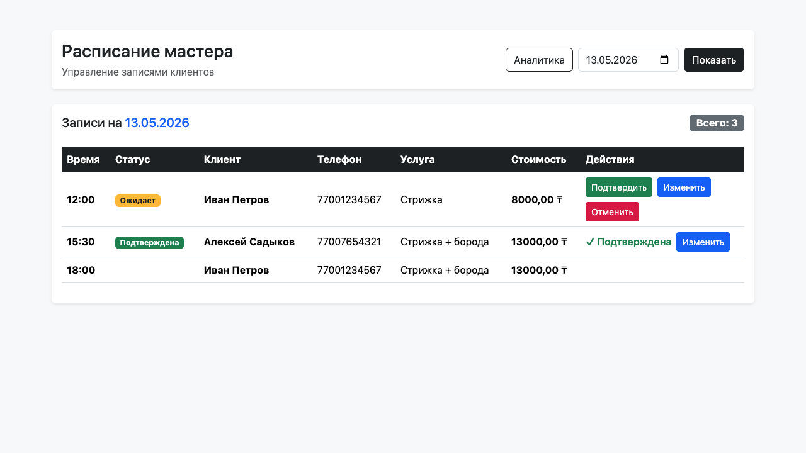
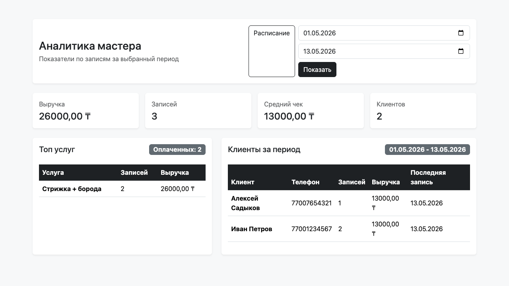

# Barber Booking

Django-проект для записи к барберу: REST API, Telegram-бот, web-расписание мастера, аналитика и тесты.

## Стек

- Python 3.13+
- Django 6
- Django REST Framework
- PostgreSQL
- aiogram 3
- Docker Compose
- pytest + pytest-django
- Bootstrap 5 для web-интерфейса мастера

## Возможности

- список активных услуг;
- генерация свободных слотов с учетом длительности услуги;
- создание записи через API;
- ограничение записи минимум за 30 минут;
- отмена минимум за 2 часа;
- одна активная запись на Telegram-пользователя;
- Telegram-бот для записи, просмотра, отмены и изменения записи;
- web-расписание мастера;
- страница аналитики по периоду.

## Скриншоты





## Быстрый запуск через Docker

1. Создать файл окружения:

```bash
cp backend/.env.example backend/.env
```

2. Заполнить `BOT_TOKEN` в `backend/.env`.

3. Запустить проект:

```bash
docker compose up --build
```

4. Открыть:

- Backend API: `http://127.0.0.1:8001/api/`
- Расписание мастера: `http://127.0.0.1:8001/master/schedule/`
- Аналитика мастера: `http://127.0.0.1:8001/master/analytics/`

## Локальный запуск backend

```bash
python -m venv .venv
source .venv/bin/activate
pip install -r backend/requirements.txt
cp backend/.env.example backend/.env
cd backend
python manage.py migrate
python manage.py runserver
```

При локальном запуске API будет доступен на `http://127.0.0.1:8000/api/`.

## Локальный запуск Telegram-бота

В `backend/.env` должен быть указан `BOT_TOKEN`, а `API_BASE_URL` должен смотреть на backend.

```bash
source .venv/bin/activate
python -m bot.main
```

Для Docker Compose бот использует `API_BASE_URL=http://backend:8000/api`.

## Переменные окружения

Основной пример находится в [backend/.env.example](backend/.env.example).

| Переменная | Назначение |
| --- | --- |
| `SECRET_KEY` | Django secret key |
| `DEBUG` | Режим отладки |
| `ALLOWED_HOSTS` | Разрешенные hostnames |
| `TIME_ZONE` | Часовой пояс проекта |
| `DB_ENGINE` | Backend БД Django |
| `DB_NAME` | Имя базы данных |
| `DB_USER` | Пользователь БД |
| `DB_PASSWORD` | Пароль БД |
| `DB_HOST` | Host БД |
| `DB_PORT` | Port БД |
| `BOT_TOKEN` | Токен Telegram-бота |
| `API_BASE_URL` | Base URL backend API для бота |

## API endpoints

| Метод | Endpoint | Описание |
| --- | --- | --- |
| `GET` | `/api/services/` | Список активных услуг |
| `GET` | `/api/slots/?date=YYYY-MM-DD&service_id=1` | Свободные слоты на дату для услуги |
| `POST` | `/api/bookings/` | Создать запись |
| `GET` | `/api/my-booking/?telegram_id=123` | Активная запись пользователя |
| `GET` | `/api/clients/by-telegram/?telegram_id=123` | Данные клиента по Telegram ID |
| `DELETE` | `/api/bookings/<id>/` | Отменить запись пользователем |

### Пример создания записи

```json
{
  "service_id": 1,
  "telegram_id": 123456789,
  "client_name": "Иван",
  "phone": "77001234567",
  "booking_date": "2026-05-20",
  "booking_time": "12:00"
}
```

## Web-интерфейс мастера

| URL | Назначение |
| --- | --- |
| `/master/schedule/` | Расписание записей на выбранную дату |
| `/master/analytics/` | Аналитика за выбранный период |
| `/booking/<id>/confirm/` | Подтверждение записи мастером |
| `/booking/<id>/cancel/` | Отмена записи мастером |
| `/booking/<id>/edit/` | Изменение даты и времени записи |

## Тесты

```bash
cd backend
../.venv/bin/pytest
```

Тесты используют `config.settings_test` и SQLite in-memory, поэтому не требуют PostgreSQL.

## Структура проекта

```text
backend/
  apps/booking/
    models.py
    serializers.py
    selectors.py
    services.py
    views.py
    urls.py
    test/
  config/
bot/
docker/
docs/screenshots/
docker-compose.yml
```

## Подготовка к GitHub

- секреты хранятся в `backend/.env` и не коммитятся;
- пример окружения хранится в `backend/.env.example`;
- локальная SQLite-БД и кэши исключены через `.gitignore`;
- проект проверяется командой `pytest`.
